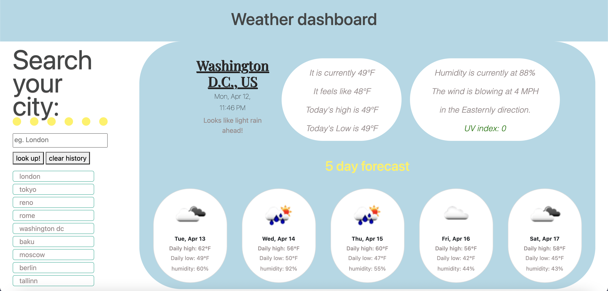
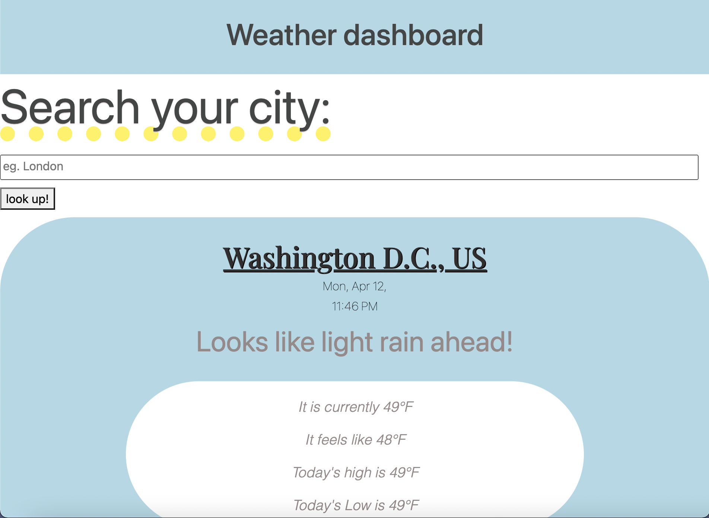
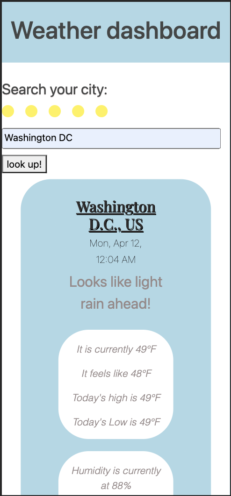

# Forest Wilson - Homework 6 - Weather Dashboard
MIT - (https://opensource.org/licenses/MIT) - For Good.
<!-- Original deployment date: April 13th, 2021 -->

## Table of Contents:
- [This week's concepts](#this-weeks-concepts)
- [Tech used](#tech-used)
- [Project description](#project-description)
- [Usage instructions](#usage-instructions)
- [Project installation](#project-installation)
- [Additional comments](#additional-comments)
- [Contribution information](#contribution-information)
- [Questions](#questions-or-concerns)
- [Extras](#extras)

### About This Project

* # This weeks concepts:
  1. Bootstrap
  2. API fetching

* # Tech used:
  1. HTML
  2. CSS
  3. JavaScript
  4. JQuery
  5. Bootstrap

* # Project description:
  Given a fascination about weather around the world, I developed an app that uses Openweathermap's API to display current timezone, weather right now, and a 5 day forecast for cities across the world. You have access to a clickable history of all the cities you have searched. I also use Bootstrap to help page responsiveness.

* # Usage instructions
  Use your city name to get up-to-date weather forcasts for your area. If you are curious about weather around the world, you may enter any big city to learn about their weather as well. This app may also be used to see a city's timezone.

* # Project installation
  1. Visit the deployment link
  2. Enter desired city 
  3. Enjoy.
     
* # Additional comments
(Apr/13/21)

  - This project took me way longer than I thought to complete. Looking back on how many moving parts were really needed to get this app running I feel good that I was able to impliment all the criteria, but it really seemed like every aspect of this was breaking all the time, but I guess thats how it goes.
  
  - also spent way too long trying to get local time to display accuratly on the selected city screen just to reread the prompt and realize it was totally uneeded. doh.

  - It was really hard to tell if the weather info i was grabbing was even accurate to the area, so it took me a while to make finalize the appened data for the cities correctly. the data objects helped me confirm that the cities had unique weather data showing up, but when I compared to other weather app for the cities that data seemed to diverge a lot. to the best of my knowledge the weather is getting called correctly, but I think that you might need to buy the dlc to get the real accurate weather.

  - There seems to be a bug where if you are loading in for the first time, the dashboard display will look broken. To fix this, just search an initial city. 

(Oct/26/21)

  - Now that I know better technologies such as React.js, I would like to re-create this app, since I love the concept of quickly finding out about weather around the world. In the future :)

#### Contribution information 

- If you would like to contribute to this project, please follow best practices and message me at one of the provided contacts bellow if you want to push!

###### Questions or concerns? 
* Please contact me at one of the following!

  Email - Hexaforest@gmail.com
  gitHub - https://github.com/ForestW70/

# Extras

* Screenshots:
  - 
  - 
  - 

* Links:
  - [Repo page](https://github.com/ForestW70/Week-6-Weather-Dashboard)
  - [Deployed page](https://forestw70.github.io/Week-6-Weather-Dashboard/)
